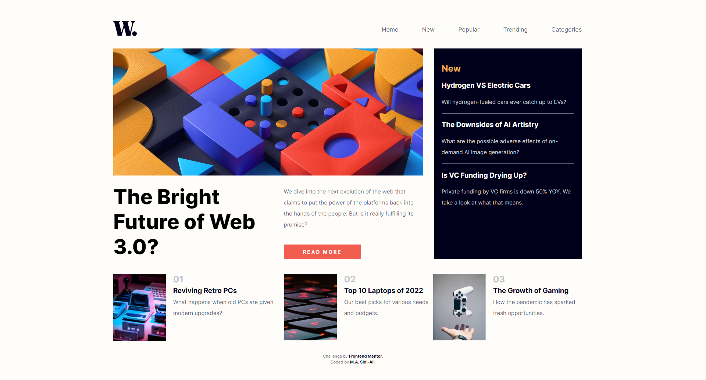

# Frontend Mentor - News homepage solution

This is a solution to the [News homepage challenge on Frontend Mentor](https://www.frontendmentor.io/challenges/news-homepage-H6SWTa1MFl). Frontend Mentor challenges help you improve your coding skills by building realistic projects.

## Table of contents

- [Overview](#overview)
  - [The challenge](#the-challenge)
  - [Screenshot](#screenshot)
  - [Links](#links)
- [My process](#my-process)
  - [Built with](#built-with)
  - [What I learned](#what-i-learned)
  - [Continued development](#continued-development)
  - [Useful resources](#useful-resources)
- [Author](#author)

## Overview

### The challenge

Users should be able to:

- View the optimal layout for the interface depending on their device's screen size
- See hover and focus states for all interactive elements on the page
- **Bonus**: Toggle the mobile menu (requires some JavaScript)

### Screenshot

Follow the link below to see a screenshot of my solution.



### Links

- Solution URL: [](https://github.com/Sidi-Ali/news-homepage)
- Live Site URL: []( https://sidi-ali.github.io/news-homepage/)

## My process
I used a mobile-first workflow to complete this project.

### Built with

- HTML5
- CSS custom properties
- Flexbox
- JavaScript


### What I learned

My major learning while working through this project was to toggle the navigation bar from the right side of the page.

```html
<div id="mySidenav" class="sidenav">
  <a href="#" class="closebtn icon" onclick="closeNav()">&#9587;</a>
  <span class="icon" onclick="openNav()">&#9776;</span>
</div>
```

```js
function openNav() {
  document.getElementById("mySidenav").style.width = "250px";
  document.body.style.backgroundColor = "rgba(0,0,0,0.4)";
}

function closeNav() {
  document.getElementById("mySidenav").style.width = "0";
  document.body.style.backgroundColor = "hsl(36, 100%, 99%)";
}
```


### Continued development

I have used flexbox in this project and have seen the need to use both flexbox and grid in the same project. I will implement this concept in future projects.

### Useful resources

- [Flexbox](flexbox.io) - This is an amazing tutorial that helped me finally understand Flexbox. I'd recommend it to anyone still learning this concept.

## Author

- Linkedin - [M. A. Sidi-Ali](https://www.linkedin.com/in/muhammad-adamu-sidi-ali-907a486b/)
- Frontend Mentor - [@Sidi-Ali](https://www.frontendmentor.io/profile/Sidi-Ali)
